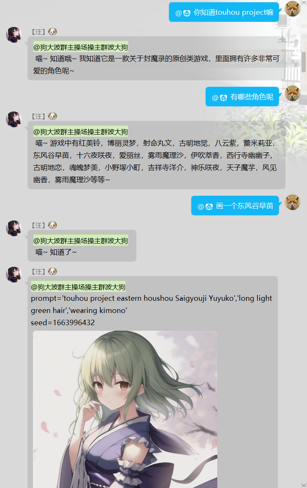
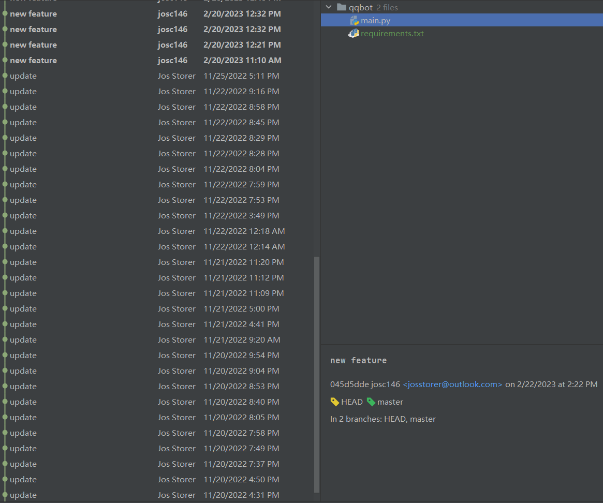

# Mix-ChatGPT-And-AI-Painting

a bot application running on Tencent QQ that integrates GPT chatbot capabilities with AI painting.

一个运行于腾讯qq上的, 将gpt聊天能力与ai绘画集成的机器人应用.

Due to limited personal energy, currently this project is mainly aimed at Chinese users. If I have time in the
future, I may add more internationalization support. For English users, it should not be difficult to understand with
the help of variable names in the code. You can also translate this readme file into English to help you understand this
project. The core idea is to use prompts to guide the insertion of identifying text for the program to recognize and
execute instructions. Similar approaches can also be used for services such as voice services, group management, and
user image analysis. If this project can inspire or help you, I would be honored.

## Example

## 常见问题

1. at机器人对话时, 本程序出现`AttributeError: 'Error' object has no attribute 'message'`
  - 一般是填写账号密码登陆openai的登陆错误, 如果你有代理, 请在[main.py#L95](https://github.com/josStorer/mix-chatgpt-and-ai-painting/blob/master/main.py#L95)
  邮箱密码后添加`"proxy": "你的代理地址"`, 如果你没有代理, 请将`use_chatgpt`设为`False`, 并填写`api_key`
2. 画图时, 机器人提示, `错误: 'images'`
  - 是Stable Diffusion WebUI没有暴露api, 你需要在启动时, 额外输入`--api`参数, 如果你使用的是他人的整合包, 请找到相关启动文件(一般是.bat后缀),
  找到其中有参数的一行, 如`--deepdanbooru`, `--xformers`, 在后面加上一个`--api`, 注意参数间空格
3. at机器人对话时, 机器人提示, `错误: [WinError 3] The system cannot find the path specified`
  - 需要设置你系统的环境变量, 设置`HOME`环境变量为某个文件夹路径, 用于存储配置信息

如有使用问题, 可加qq群283430436交流, 也可进行试玩

## 食用方法

1. 下载[go-cqhttp](https://github.com/Mrs4s/go-cqhttp/releases), 注意底部`show all ...`展开, windows一般使用windows_amd64.exe
2. 启动cmd窗口, 打开到go-cqhttp所在路径, 然后通过命令行输入程序名启动, 并选择正向websocket模式
3. 扫码登录你的qq机器人
4. 下载[stable-diffusion-webui](https://github.com/AUTOMATIC1111/stable-diffusion-webui), 并安装依赖, 该项目也提供了不同系统的一键安装脚本,
   如果你是从源代码安装, 可参考https://github.com/AUTOMATIC1111/stable-diffusion-webui#installation-and-running, 如果你下载的是他人的整合包, 可略过
5. 从huggingface下载模型权重,
   如[Anything](https://huggingface.co/andite/anything-v4.0/tree/main), [Chilloutmix](https://huggingface.co/TASUKU2023/Chilloutmix/tree/main), [OrangeMixs](https://huggingface.co/WarriorMama777/OrangeMixs/tree/main),
   放置在stable-diffusion-webui的`models/Stable-diffusion`目录下
6. 启动stable-diffusion-webui, 可以参考官方项目在不同系统的[启动说明](https://github.com/AUTOMATIC1111/stable-diffusion-webui#installation-and-running),
   也可参考[sd_webui.bat](sd_webui.bat), 如果所有依赖安装正常, 可以直接用webui.py启动, 如
   `python webui.py --medvram --deepdanbooru --xformers --api`, 注意必须带有`--api`参数, 如果你使用的是他人的整合包, 可能需要自己手动在启动脚本加上`--api`参数, 参考上面的`常见问题`一栏
7. 克隆本项目, `git clone https://github.com/josStorer/mix-chatgpt-and-ai-painting`, 并`pip install -r requirements.txt`
   安装依赖
8. 在本项目的[config.py](config.py)内修改属于你自己的配置,
   必须修改的变量为: `api_key`/`email,password`, `master_id`, `bot_id`,
   建议考虑实际情况修改的变量为: `use_chatgpt`, `working_groups`, `auth_vip_for_all`, `local_mode`, 其他请自行抉择
9. 使用`python main.py`启动本项目
10. 可选, 在本项目的几个.bat文件中, 正确配置你自己的路径, 然后设置开机启动[gpu_connect.bat](gpu_connect.bat),
    之后自己`win+tab`新建一个桌面干别的事情,
    让你的电脑闲置时给群友玩耍吧
11. 更多详细配置, 及服务器24小时在线模式, 查看[config.py](config.py)

## 指令一览

- 直接at机器人, 即可调用openai api进行对话, 在config.py内配置auth_vip_for_all=True授予所有人权限, 否则请使用vip指令授权指定qq号
- 通过at机器人+警号指令, 可操作指定机器人, 例如`@机器人1号 #上线`, 适用于群内有多个机器人的情况, 而直接使用警号指令则作用于所有机器人

| 指令      | 示例                      | 说明                                                                                                                                                                                                                                     |
| --------- | ------------------------- | ---------------------------------------------------------------------------------------------------------------------------------------------------------------------------------------------------------------------------------------- |
| #gpt切换  | #gpt切换                  | 在gpt3与chatgpt模式间切换                                                                                                                                                                                                                |
| #上线     | #上线                     | 令该群聊的机器人上线, 使其允许执行openai调用和ai绘画                                                                                                                                                                                     |
| #下线     | #下线                     | 令该群聊的机器人下线, 使其不允许执行openai调用和ai绘画                                                                                                                                                                                   |
| #画图     | #画图 512x512.girl        | 令机器人在该群聊中画图, 例如: `#画图 girl`, 使用点或分号分隔, 允许一些快捷操作, 使用花括号允许传入细致的json配置操作, 详细请使用 `#帮助` 查看                                                                                            |
| #d        | #d 512x512.girl           | vip列表内的用户允许使用的快捷画图操作, 效果同 `#画图`                                                                                                                                                                                    |
| #撤回     | #撤回                     | 撤回由你触发的上一条机器人消息                                                                                                                                                                                                           |
| #拉黑     | #拉黑 123456              | 禁止该用户在该群聊中使用机器人                                                                                                                                                                                                           |
| #解除     | #解除 123456              | 解除对该用户的拉黑                                                                                                                                                                                                                       |
| #vip      | #vip 123456               | 将该用户加入vip列表, vip列表内的用户可以使用 `#d` 指令, 也可以通过at调用机器人, 执行openai api对话                                                                                                                                       |
| #unvip    | #unvip 123456             | 将该用户从vip列表中移除                                                                                                                                                                                                                  |
| #清理对话 | #清理对话                 | 清理对话上下文(先前对话内容过长导致请求失败时, 可以选择清理)                                                                                                                                                                             |
| #帮助     | #帮助                     | 显示面向群内普通用户的帮助信息, 不含vip指令和master指令                                                                                                                                                                                  |
| #默认     | #默认                     | 显示 `#画图` 的默认json配置, 你可以直接复制这些信息自己修改, 然后再通过 `#画图 {...}` 传回去调用                                                                                                                                         |
| #黑名单   | #黑名单                   | 显示黑名单列表                                                                                                                                                                                                                           |
| #at切换   | #at切换                   | 切换机器人响应模式, 默认总是需要at机器人以进行openai回复, 切换后可以直接对话, 对每句话都进行回复                                                                                                                                         |
| #model    | #model anything-v4        | 直接输入`#model`查看当前激活模型及所有可用模型列表, 输入`#model 模型名`进行模型切换, 模型名不需要完整, 只需要存在于目标模型名中即可, 不区分大小写, 例如, 完整的模型名为`anything-v4.0-pruned.safetensors`, 可直接输入`#model v4`进行切换 |
| #vae      | #vae Anything-V3.0.vae.pt | 直接输入`#vae`查看当前使用的VAE, 输入`#vae VAE名称`进行VAE切换, 注意与模型切换不同, VAE切换必须完全匹配文件名称                                                                                                                          |

## 文件功能说明

- main.py: 程序入口, 使用python main.py启动
- config.py: 根据你自己的情况进行调整的配置文件, 基本每一项都有注释, 直接查看即可
- operations.py: 各项指令功能, 文件底部有一个字典变量存储了所有指令及对应函数调用, 仿照扩展即可
- requirements.txt: 依赖列表, 使用pip install -r requirements.txt安装
- global_var: 全局变量
- utils.py: 一些工具函数
- ws_wrapper.py: 封装了一些websocket消息, 用于和go-cqhttp通信
- gpu_connect.bat: 用于快捷启动各关联程序, 请自行修改路径
- sd_webui.bat: 快捷启动stable-diffusion-webui
- cqhttp.bat: 快捷启动go-cqhttp

修改main.py内的on_message函数, 及ws_wrapper.py, 以尝试为QQ以外的其他程序开发机器人应用

## 附注

这个项目一开始只是给沙雕群友们搞的玩具, 图一乐来着, 最近搞真人模型的时候, 顺便集成了gpt对话功能, 感觉效果还不错, 就开源了

核心思路看config.py的prompt就懂了, 类似思路, 也可用于生成语音对话, 管理群聊等, 仅作抛砖引玉, 欢迎大伙fork改造

代码和git日志很拉, 因为一开始就是个玩具项目, 直接一把梭做出来的, 而且记录里还有我自己的域名和key等隐私信息, 所以直接新建了一个项目,
没有log了

